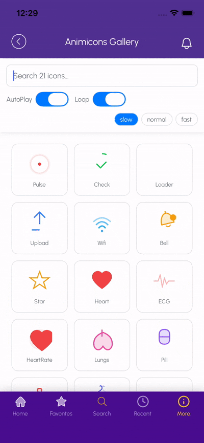
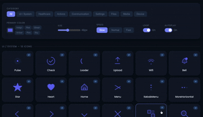

# @animicons

Animated SVG icon library for React and React Native. 104 icons across 12 categories. 60fps animations. Full colour customisation. Tree-shakeable.

## Preview

<table>
  <tr>
    <th align="center">React Native</th>
    <th align="center">Web (React)</th>
  </tr>
  <tr>
    <td align="center">
      
    </td>
    <td align="center">
      
    </td>
  </tr>
</table>

**[Live Web Playground →](https://prakashs1117.github.io/animicons/)**

## Packages

| Package | Platform | Version | Install |
|---------|----------|---------|---------|
| `@animicons/react` | React (web) | `0.3.0` | `npm install @animicons/react react-native-svg` |
| `@animicons/react-native` | React Native | `0.3.0` | `npm install @animicons/react-native react-native-svg react-native-reanimated` |

## Usage

```tsx
// Web
import { ECG, Brain, Loader } from '@animicons/react'

// React Native
import { ECG, Brain, Loader } from '@animicons/react-native'

// Auto-plays, loops forever
<ECG size={48} color="#f43f5e" />

// Full colour control
<Brain
  size={40}
  strokeColor="#ec4899"
  fillColor="#fce7f3"
  secondaryColor="#fbcfe8"
  strokeWidth={2}
  opacity={0.9}
/>

// Slow, plays once, fires callback
<Loader speed="slow" loop={false} onAnimationEnd={() => console.log('done')} />
```

## Props

| Prop | Type | Default | Description |
|------|------|---------|-------------|
| `size` | `number` | `48` | Width and height in dp/px |
| `color` | `string` | icon default | Primary shorthand — sets stroke + fill |
| `strokeColor` | `string` | `color` | Explicit stroke override |
| `fillColor` | `string` | `color` | Explicit fill override |
| `secondaryColor` | `string` | auto | Background / glow colour |
| `opacity` | `number` | `1` | Global opacity (0–1) |
| `strokeWidth` | `number` | icon default | Stroke thickness |
| `autoPlay` | `boolean` | `true` | Start animation on mount |
| `loop` | `boolean` | `true` | Repeat indefinitely |
| `speed` | `'slow'\|'normal'\|'fast'` | `'normal'` | Duration multiplier |
| `style` | `object` | — | Container style |
| `onAnimationEnd` | `() => void` | — | Fires at end of each cycle |

## Icons

### UI / System
`Pulse` `Check` `Loader` `Upload` `Wifi` `Bell` `Star` `Heart`

### Navigation & Structure
`Home` `Menu` `KebabMenu` `MoreHorizontal` `Back` `Forward` `ChevronDown` `Close` `Grid` `Search`

### Navigation Additions — Batch 1
`ChevronUp` `ChevronLeft` `ChevronRight` `ArrowUp` `ArrowDown` `ArrowLeft` `SortAsc` `SortDesc` `ZoomIn` `ZoomOut` `AlertTriangle` `AlertCircle` `Calendar` `Clock` `Globe` `Flag` `Notification`

### Core Actions
`Add` `Edit` `Save` `Trash` `Share` `Download` `Refresh` `Sync` `Copy` `Pin` `Bookmark` `Filter`

### Actions Additions — Batch 1
`Undo` `Redo`

### Communication & Social
`Mail` `Chat` `Phone` `Video` `User` `Users` `ThumbsUp` `Send` `Reaction` `Mention`

### Settings & Configuration
`Settings` `Sliders` `Lock` `Unlock` `Key` `Eye` `EyeOff` `Info` `Help`

### Settings Additions — Batch 1
`Logout`

### File & Content
`Folder` `Document` `Image` `Attachment` `Cloud` `Link` `Archive` `Tag`

### Media Playback
`Play` `Pause` `Stop` `FastForward` `Rewind` `Volume` `Mute` `Microphone`

### Device & Hardware
`Battery` `Bluetooth` `Location` `CloudSync` `Camera` `Brightness`

### Healthcare
`ECG` `HeartRate` `Lungs` `Pill` `Thermometer` `DNA` `Syringe` `Brain` `BloodDrop` `Steps` `Sleep` `Oxygen` `Medkit`

## React Native setup

Add to `babel.config.js`:
```js
// babel.config.js
module.exports = {
  presets: ['module:metro-react-native-babel-preset'], // or 'babel-preset-expo' for Expo
  plugins: ['react-native-reanimated/plugin'],
};
```

Expo:
```bash
npx expo install react-native-svg react-native-reanimated
```

## Framework Integration

### Next.js (App Router)

Install the web package:

```bash
npm install @animicons/react react-native-svg
```

Animated icons use React state and CSS animations, so they must run on the client. Add the `'use client'` directive to any Server Component that renders them:

```tsx
// app/components/StatusBadge.tsx
'use client'

import { Loader, Check } from '@animicons/react'

export function StatusBadge({ loading }: { loading: boolean }) {
  return loading ? <Loader size={24} /> : <Check size={24} color="#22c55e" />
}
```

Static (non-animated) use inside Server Components is not supported — always wrap in a Client Component boundary.

### Expo

Install the React Native package and peer dependencies via the Expo CLI (this ensures version compatibility):

```bash
npx expo install react-native-reanimated react-native-svg
npm install @animicons/react-native
```

Add the Reanimated Babel plugin to `babel.config.js`:

```js
module.exports = {
  presets: ['babel-preset-expo'],
  plugins: ['react-native-reanimated/plugin'],
}
```

Restart Metro with a cleared cache after adding the plugin:

```bash
npx expo start --clear
```

### Vite + React

Install the web package:

```bash
npm install @animicons/react react-native-svg
```

No additional configuration is required — `@animicons/react` ships pre-bundled CSS animations and works out of the box with Vite's default setup.

```tsx
import { Bell, Loader } from '@animicons/react'
```

### Bare React Native

Install the package and peer dependencies:

```bash
npm install @animicons/react-native react-native-svg react-native-reanimated
```

Link the native modules (React Native 0.73+ auto-links; older versions may need explicit linking):

```bash
npx react-native link react-native-svg
```

Add the Reanimated Babel plugin to `babel.config.js`:

```js
module.exports = {
  presets: ['module:metro-react-native-babel-preset'],
  plugins: ['react-native-reanimated/plugin'],
}
```

Clear Metro cache after modifying `babel.config.js`:

```bash
npx react-native start --reset-cache
```

## Adding new icons (for maintainers)

1. Add path data to `packages/shared/src/paths/<category>/NewIcon.ts`
2. Add component to `packages/react/src/icons/<category>/NewIcon.tsx`
3. Add component to `packages/react-native/src/icons/<category>/NewIcon.tsx`
4. Add `export { NewIcon } from './NewIcon'` to each `icons/<category>/index.ts`
5. Bump minor version in both `package.json` files
6. `npm run build && npm run publish:web && npm run publish:rn`

Existing consumers are never affected — all exports are additive.

## License

MIT
